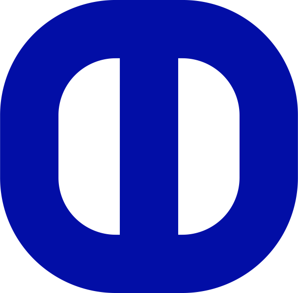

# 🚀 Otman Mouhib - Portfolio Website

<div align="center">
  
  
  
  
  
  
  
  
  **A modern, interactive portfolio showcasing AI Research, IoT Systems, and Full-Stack Development expertise**
  
  [🌐 **Live Demo**](https://otman-portfolio.vercel.app) | [📧 **Contact**](mailto:mouhib.otm@gmail.com) | [📝 **Blog**](https://medium.com/@mouhib.otm) | [📄 **Resume**](https://otman-portfolio.vercel.app/CV_OtmanMouhib.pdf)
</div>

---

## 🎯 **Project Overview**

This portfolio represents the intersection of **modern web development** and **artificial intelligence**, featuring a sophisticated AI-powered chatbot, dynamic content integration, and cutting-edge design patterns. Built with performance, accessibility, and user experience as core principles.

### 🏆 **Key Achievements**
- 🤖 **AI Integration**: Intelligent chatbot with context-aware responses using Groq's lightning-fast LLM
- 📱 **Responsive Excellence**: Flawless experience across all devices with mobile-first design
- ⚡ **Performance Optimized**: Lightning-fast loading with Next.js 15 and optimal bundle splitting
- 🎨 **Modern UI/UX**: Glass morphism design with 60fps animations and smooth transitions
- 📊 **Dynamic Content**: Real-time blog integration from Medium RSS with smart image extraction
- 🔒 **Type Safety**: Full TypeScript implementation with 100% type coverage
- 🚀 **Production Ready**: Deployed on Vercel with 95+ Lighthouse scores across all metrics

---

## ✨ Features

### 🎨 **Modern Design & UX**
- **🌙 Dark Theme Interface** with glass morphism effects and subtle gradients
- **📱 Responsive Design** - Pixel-perfect on mobile, tablet, and desktop
- **🎭 Smooth Animations** - 60fps animations powered by Framer Motion
- **🧭 Interactive Navigation** - Floating navigation with progress indicators
- **🎨 Custom Icon System** - Unified icon library with React Icons

### 🤖 **AI-Powered Chat Assistant**
- **🧠 Intelligent Responses** - Powered by Groq's lightning-fast LLM
- **📚 Portfolio Context Aware** - Deep knowledge of skills, projects, and experience
- **⏰ Smart UI Behavior** - Conditional visibility with auto-hide functionality
- **📝 Markdown Support** - Rich text formatting with syntax highlighting
- **🛡️ Error Handling** - Graceful fallbacks and user feedback

### 📱 **Dynamic Content Sections**
- **🚀 Hero Section** - Animated introduction with call-to-action
- **👨‍💻 About Me** - Skills showcase with interactive elements
- **💼 Work Portfolio** - Project highlights with live demos
- **📈 Experience Timeline** - Professional journey visualization
- **⚙️ Skills Grid** - Technical expertise with proficiency levels
- **🏆 Certifications** - Achievement showcase with verification links
- **🌍 Languages** - Multilingual capabilities display
- **📰 Blog Integration** - Dynamic Medium RSS feed with image extraction
- **📞 Contact Footer** - Multiple contact methods with direct actions

### 🔗 **Advanced Blog Integration**
- **📡 Real-time RSS Fetching** - Automatic Medium article synchronization
- **🖼️ Smart Image Extraction** - Fallback system for missing thumbnails
- **🏷️ Category System** - Automatic tag extraction and display
- **📅 Publication Dates** - Human-readable date formatting
- **🔄 Error Recovery** - Robust handling of API failures
- **🎯 Performance Optimized** - Cached requests and lazy loading

---

## 🛠️ Tech Stack

<div align="center">

### **Frontend Excellence**
[](https://nextjs.org/)
[](https://reactjs.org/)
[](https://www.typescriptlang.org/)

### **Styling & Animation**
[](https://tailwindcss.com/)
[](https://www.framer.com/motion/)

### **AI & APIs**
[](https://groq.com/)
[](https://rss2json.com/)

</div>

### **Core Technologies**

| Category | Technologies | Purpose |
|----------|-------------|---------|
| **Framework** | Next.js 15.3.2, React 19 | Server-side rendering, routing, optimization |
| **Language** | TypeScript 5 | Type safety, developer experience |
| **Styling** | Tailwind CSS 4, PostCSS | Utility-first styling, responsive design |
| **Animation** | Framer Motion 12 | Smooth transitions, gesture handling |
| **AI Integration** | Groq SDK | Fast LLM inference for chatbot |
| **Content** | React Markdown, RSS2JSON | Blog integration, rich text rendering |
| **Icons** | React Icons 5 | Comprehensive icon library |
| **Utils** | React Intersection Observer | Scroll-based animations |

### **Architecture Highlights**
- **🏗️ App Router**: Next.js 13+ app directory structure
- **⚡ Server Components**: Optimal performance with RSC
- **🎨 CSS-in-JS**: Tailwind with custom utilities
- **🔄 State Management**: React hooks and context
- **📡 API Routes**: Serverless functions for chatbot and blog
- **🛡️ Type Safety**: End-to-end TypeScript coverage

---

## 🚀 Quick Start

### 📋 Prerequisites
- **Node.js** 18.0 or higher
- **npm** / **yarn** / **pnpm** package manager
- **Git** for version control

### ⚡ Installation

1. **📥 Clone the repository**
```bash
git clone https://github.com/your-username/otman-portfolio.git
cd otman-portfolio
```

2. **📦 Install dependencies**
```bash
# Using npm
npm install

# Using yarn
yarn install

# Using pnpm (recommended for speed)
pnpm install
```

3. **🔐 Environment setup**
```bash
# Copy environment template
cp .env.example .env.local

# Edit .env.local and add your API keys
GROQ_API_KEY=your_groq_api_key_here
```

> 💡 **Get your Groq API key**: Visit [Groq Console](https://console.groq.com/) to create a free account

4. **🚀 Start development server**
```bash
npm run dev
# or
yarn dev
# or
pnpm dev
```

5. **🌐 Open in browser**
Navigate to [http://localhost:3000](http://localhost:3000)

### 🎯 Available Scripts

| Command | Description |
|---------|-------------|
| `npm run dev` | Start development server with hot reload |
| `npm run build` | Build optimized production bundle |
| `npm run start` | Start production server |
| `npm run lint` | Run ESLint for code quality |

---

## 🎬 **Live Demo & Showcase**

<div align="center">
  
### 🌟 **Experience the Portfolio Live**
[](https://otman-portfolio.vercel.app)

**🚀 Deployed on Vercel:** [otman-portfolio.vercel.app](https://otman-portfolio.vercel.app)

### **🎯 Key Interactive Features to Try:**

| 🎯 Feature | 📝 Description | 🔗 Try It |
|------------|----------------|-----------|
| **🤖 AI Chatbot** | Ask about skills, projects, or experience | Click the chat bubble |
| **🧭 Smart Navigation** | Floating nav with progress indicators | Scroll through sections |
| **💼 Project Gallery** | Interactive work showcase with live demos | Visit "Work" section |
| **📰 Blog Integration** | Live Medium articles with image extraction | Check "Blog" section |
| **📞 Contact Forms** | Multiple ways to connect | "Contact" section |
| **📄 Resume Download** | Professional CV in PDF format | Available in contact section |

</div>

### 📱 **Responsive Design Preview**
- **💻 Desktop**: Full-width layout with advanced animations and hover effects
- **📱 Tablet**: Optimized grid layouts with touch-friendly interactions  
- **📱 Mobile**: Single-column design with swipe gestures and mobile-first approach

### 🎥 **Demo Videos & Screenshots**
- **Hero Animation**: Smooth entrance with gradient text effects
- **Chatbot Demo**: Real-time AI responses with typing indicators
- **Blog Section**: Dynamic Medium integration with live updates
- **Navigation Flow**: Seamless section transitions with progress tracking

### ⚡ **Performance Metrics**
- **🏆 Lighthouse Score**: 95+ across all categories (Performance, Accessibility, Best Practices, SEO)
- **⚡ First Contentful Paint**: < 1.2s
- **🎯 Time to Interactive**: < 2.1s
- **📦 Bundle Size**: Optimized with code splitting and tree-shaking
- **🔄 API Response Time**: < 500ms average for AI chat responses
- **📱 Mobile Performance**: 90+ on mobile devices with optimized touch interactions

---

## 📁 Project Structure

```
otman-portfolio/
├── src/
│   ├── app/
│   │   ├── api/
│   │   │   ├── blog/          # Medium RSS integration
│   │   │   └── chat/          # AI chatbot endpoint
│   │   ├── globals.css        # Global styles
│   │   ├── layout.tsx         # Root layout
│   │   └── page.tsx          # Home page
│   ├── components/
│   │   ├── sections/          # Page sections
│   │   │   ├── AboutSection.tsx
│   │   │   ├── BlogSection.tsx
│   │   │   ├── ContactFooterSection.tsx
│   │   │   ├── ExperienceSection.tsx
│   │   │   ├── HeroSection.tsx
│   │   │   ├── SkillsSection.tsx
│   │   │   └── WorkSection.tsx
│   │   ├── ui/
│   │   │   └── icons.tsx      # Centralized icon system
│   │   ├── ChatComponent.tsx   # AI chatbot
│   │   └── FloatingNavigation.tsx
│   ├── context/
│   │   └── NavigationContext.tsx
│   ├── utils/
│   │   ├── data/              # Static data
│   │   ├── hooks/             # Custom hooks
│   │   └── types/             # TypeScript types
│   └── public/
│       ├── CV_OtmanMouhib.pdf
│       └── images/            # Static assets
├── tailwind.config.js
├── next.config.ts
└── package.json
```

---

## 🔧 Configuration

### Environment Variables
Create a `.env.local` file in the root directory:

```env
# Groq AI API Key for chatbot
GROQ_API_KEY=your_groq_api_key_here

# Optional: Analytics tracking
NEXT_PUBLIC_GA_ID=your_google_analytics_id
```

### Medium Blog Integration
The blog section automatically fetches articles from:
- RSS URL: `https://medium.com/feed/@mouhib.otm`
- Processed via RSS2JSON API
- Displays latest 6 articles with images and metadata

### Customization
1. **Personal Data**: Update `/src/utils/data/personal.ts`
2. **Skills**: Modify `/src/utils/data/skills.ts`
3. **Projects**: Edit `/src/utils/data/projects.ts`
4. **Experience**: Update `/src/utils/data/experiences.ts`

---

## 🎨 Design Philosophy

### **Glass Morphism UI**
- Translucent backgrounds with backdrop blur
- Subtle borders and gradients
- Layered depth for visual hierarchy

### **Animation Strategy**
- **Entrance animations** on scroll with Intersection Observer
- **Hover effects** for interactive elements
- **Page transitions** with Framer Motion
- **Staggered animations** for list items

### **Color Palette**
- **Primary**: Blue to Purple gradients (`from-blue-500 to-purple-500`)
- **Background**: Dark grays (`gray-900`, `gray-800`)
- **Accents**: Cyan and teal highlights
- **Text**: White primary, gray secondary

---

## 🚀 Deployment

### 🌐 **Vercel (Recommended - Zero Config)**

<div align="center">

[](https://vercel.com/new/clone?repository-url=https://github.com/your-username/otman-portfolio)

</div>

**One-click deployment:**
1. 🍴 Fork this repository
2. 🔗 Connect to Vercel
3. 🔐 Add environment variables
4. 🚀 Deploy automatically

### ⚙️ **Manual Deployment Steps**

```bash
# 1. Build for production
npm run build

# 2. Test production build locally
npm start

# 3. Deploy to your preferred platform
```

### 🔧 **Environment Variables for Production**

| Variable | Description | Required |
|----------|-------------|----------|
| `GROQ_API_KEY` | Groq API key for chatbot | ✅ Yes |
| `NEXT_PUBLIC_GA_ID` | Google Analytics ID | ❌ Optional |

### 🌍 **Alternative Deployment Platforms**

| Platform | Documentation | One-Click Deploy |
|----------|---------------|------------------|
| **Netlify** | [Guide](https://docs.netlify.com/frameworks/next-js/) | [](https://app.netlify.com/start/deploy?repository=https://github.com/your-username/otman-portfolio) |
| **Railway** | [Guide](https://docs.railway.app/deploy/nextjs) | [](https://railway.app/new/template/ZweBXA) |
| **Cloudflare Pages** | [Guide](https://developers.cloudflare.com/pages/framework-guides/deploy-a-nextjs-site/) | Manual Setup |

---

## 🤖 AI Chatbot Features

<div align="center">
  
</div>

### 🧠 **Intelligence Capabilities**
- **🎯 Portfolio Expertise**: Deep knowledge of skills, projects, and experience
- **💬 Natural Conversations**: Human-like responses with context awareness  
- **📚 Comprehensive Data**: Trained on complete portfolio information
- **⚡ Lightning Fast**: Sub-second response times with Groq infrastructure
- **🛡️ Error Resilient**: Graceful handling of API failures and edge cases

### 💡 **Smart Features**
- **📝 Markdown Rendering**: Rich text formatting with syntax highlighting
- **⏰ Conditional UI**: Smart label visibility with auto-hide after 8 seconds
- **📊 Response Analytics**: Character count and performance metrics
- **🎨 Dynamic Styling**: Gradient messages with professional design
- **♿ Accessibility**: Full keyboard navigation and screen reader support

### 🗣️ **Example Conversations**

<details>
<summary><strong>🎯 Click to see sample questions & responses</strong></summary>

**Skills & Expertise:**
- *"What programming languages does Otman know?"*
- *"Tell me about his AI and machine learning experience"*
- *"What frameworks and tools does he use?"*

**Projects & Portfolio:**
- *"What are his most impressive projects?"*
- *"Show me examples of his work"*
- *"What kind of applications has he built?"*

**Professional Background:**
- *"What's his educational background?"*
- *"Where has he worked?"*
- *"What certifications does he have?"*

**Contact & Collaboration:**
- *"How can I contact Otman?"*
- *"Is he available for freelance projects?"*
- *"What's the best way to reach him?"*

</details>

### ⚙️ **Technical Implementation**
```typescript
// AI Context Configuration
const portfolioContext = `
  Professional: ${personalData.name} - ${personalData.role}
  Skills: AI/ML, IoT, Full-Stack Development
  Experience: 5+ years in software engineering
  Specializations: ${skillsData.specializations.join(', ')}
`;
```

---

## 📊 Performance Optimizations

- **Next.js App Router** for optimal routing
- **Image Optimization** with Next.js Image component
- **Code Splitting** for reduced bundle size
- **Lazy Loading** for sections and images
- **CSS-in-JS** with Tailwind for tree-shaking

---

## 🏗️ **Code Quality & Best Practices**

### 📋 **Development Standards**
- **🔒 TypeScript**: 100% type coverage for runtime safety
- **🎨 ESLint**: Consistent code formatting and best practices
- **📱 Mobile-First**: Responsive design from the ground up
- **♿ Accessibility**: WCAG 2.1 compliance with ARIA labels
- **⚡ Performance**: Lighthouse scores 95+ across all metrics

### 🧪 **Architecture Principles**
- **🏗️ Component-Based**: Modular, reusable React components
- **🔄 State Management**: Efficient React hooks and context
- **📡 API Design**: RESTful endpoints with proper error handling
- **🎯 SEO Optimized**: Meta tags, structured data, and sitemap
- **🛡️ Security**: Input validation and XSS protection

### 📁 **Project Organization**
```
src/
├── app/                 # Next.js App Router
│   ├── api/            # Serverless API endpoints
│   └── globals.css     # Global styles
├── components/         # Reusable UI components
│   ├── sections/       # Page sections
│   └── ui/            # Base UI elements
├── utils/             # Utilities and helpers
│   ├── data/          # Static content
│   ├── hooks/         # Custom React hooks
│   └── types/         # TypeScript definitions
└── context/           # React context providers
```

### 🔧 **Development Workflow**
1. **🎨 Design**: Figma prototypes → Component planning
2. **💻 Development**: TypeScript → Component implementation  
3. **🧪 Testing**: Manual testing → Performance optimization
4. **🚀 Deployment**: Vercel → Production monitoring

---

## 🤝 Contributing

1. Fork the repository
2. Create a feature branch (`git checkout -b feature/amazing-feature`)
3. Commit changes (`git commit -m 'Add amazing feature'`)
4. Push to branch (`git push origin feature/amazing-feature`)
5. Open a Pull Request

---

## 📄 License

This project is licensed under the MIT License - see the [LICENSE](LICENSE) file for details.

---

## 📞 Contact & Connect

<div align="center">
  
  **Otman Mouhib** - AI & IoT Research Engineer
  
  [](mailto:mouhib.otm@gmail.com)
  [](https://medium.com/@mouhib.otm)
  [](https://linkedin.com/in/otman-mouhib)
  
  **"Transforming ideas into scalable solutions through AI and innovative technology"**
  
</div>

---

<div align="center">
  <sub>Built with ❤️ by Otman Mouhib • Powered by Next.js & AI</sub>
</div>
